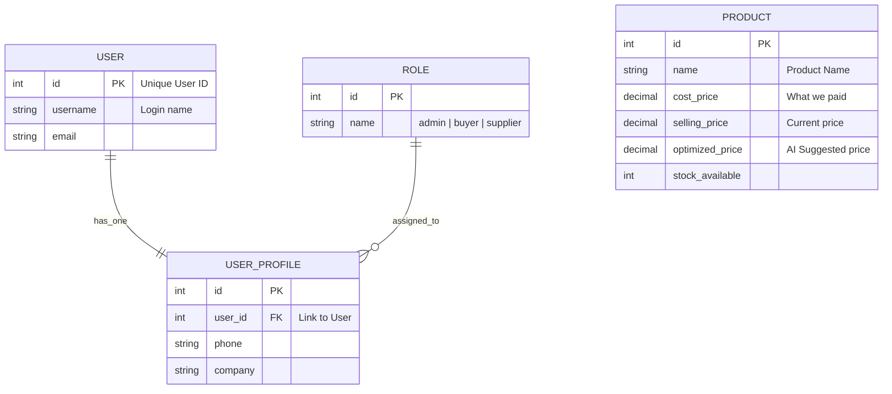

# System Design, Caching & Deployment Guide

This document is a beginner-friendly guide to how our Price Optimization Tool works under the hood, how we keep it fast, and how we deploy it to the cloud.

---

## 1. Beginner-Friendly Architecture: "The Three Musketeers"

Think of our system as a professional restaurant:

1.  **The Frontend (React - The Waiter)**: This is what the customer sees. It takes orders (clicks), displays the menu (product tables), and makes sure the customer has a smooth experience. It lives in the user's browser.
2.  **The Backend (Django - The Kitchen)**: This is where "the magic" happens. It processes data, calculates optimized prices, and checks if you are allowed to see certain information (Authentication).
3.  **The Database (SQLite/PostgreSQL - The Pantry)**: This is where all the ingredients (product data, user accounts) are stored permanently.

### Why this design?

By keeping them separate (Decoupled), we can upgrade the kitchen without changing the waiters, or hire more waiters (scale the frontend) if the restaurant gets busy!

---

## 2. Data Structure (ER Diagram)

Below is how our data is organized. Think of these as "Excel sheets" that talk to each other.

---

## 3. Deployment Flow (Docker + GCR)

Since we use **Docker** and **Google Container Registry (GCR)**, our deployment is like shipping "Cargo Containers."

### The 3 Steps to the Cloud:

1.  **Build (Dockerize)**: We wrap our code, libraries (Python/React), and environment into a "Container Image." This ensures it runs exactly the same on your laptop and in the cloud.
    - _Concept:_ `docker build` creates the container.
2.  **Ship (Push to GCR)**: We upload this container to Google's warehouse (GCR).
    - _Concept:_ `docker push` sends it to the cloud registry.
3.  **Run (Cloud Run / GKE)**: Google Cloud pulls this image and starts the server.

**Why Docker?** It solves the "It works on my machine" problem once and for all. It packages everything needed to run the app in one isolated box.

---

## 4. Caching: Making the App "Blink-of-an-Eye" Fast

Calculating prices for thousands of products every time someone refreshes the page is expensive and slow. Caching is like **keeping a notepad of common answers.**

| Layer       | Tool        | What it does                                                                                                                                                                         |
| :---------- | :---------- | :----------------------------------------------------------------------------------------------------------------------------------------------------------------------------------- |
| **Browser** | React Query | Keeps the data on the screen so it doesn't "flicker" when you switch tabs.                                                                                                           |
| **Server**  | Redis       | Stays in the backend memory. If User A asks for "Product 101", Django computes it and saves it in Redis. When User B asks for it, Django gets it from Redis in 1ms instead of 500ms. |
| **Edge**    | Cloudflare  | Keeps images and static files close to the user's physical location (e.g., a server in Mumbai for a user in Mumbai).                                                                 |

---

## 5. Interview Q&A (Common Questions)

### Q1: Why did you choose JWT for authentication instead of Sessions?

**Answer:** JWTs are **stateless**. The server doesn't need to store "who is logged in" in its memory. Since we use Docker and might have multiple backend containers, any container can verify the user without needing to check a central session database. This makes scaling (adding more servers) very easy.

### Q2: What happens to the cache if a Product's price changes?

**Answer:** This is **Cache Invalidation**. We must ensure the "stale" (old) data is removed. In Django, we use signals or manual logic in `save()` to call `cache.delete(f"product_{id}")` whenever a product is updated.

### Q3: Why GCR and Docker? Couldn't you just upload the code?

**Answer:** Using Docker ensures **Environment Parity**. It includes the exact version of Python, libraries, and system packages. GCR is a secure place to store these "frozen" versions of the app, making it easy to roll back to a previous version if a bug is found.

### Q4: How would you handle a sudden spike of 1 million users?

**Answer:**

1.  **Horizontal Scaling**: Spin up more Docker containers in Google Cloud instantly.
2.  **Read Replicas**: Use multiple databases just for "Reading" data so the main database isn't overwhelmed.
3.  **Aggressive Caching**: Cache everything that doesn't change every second (like product lists) in Redis.

### Q5: If Redis (the cache) goes down, will the app crash?

**Answer:** No. We use **Fall-through** logic. If Redis is unreachable, the code should automatically go to the main Database. It will be slower, but the app stays functional. This is called "Graceful Degradation."

---

## 6. How to Improve (Next Steps)

If we were to build "Version 2.0," here is what we would do:

1.  **Celery Tasks**: Move the "Price Optimization" heavy math to a background queue so the user doesn't have to wait.
2.  **PostgreSQL**: Upgrade from SQLite to PostgreSQL for better performance with hundreds of users.
3.  **Monitoring**: Add Google Cloud Log Explorer to catch errors before the user even reports them.
